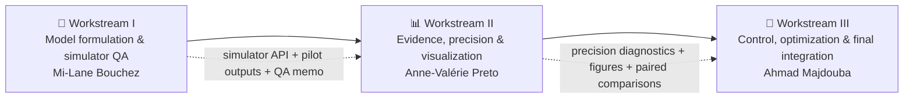

# Vaccination Project
### Strategic Workstream Charter · Task Assignment Sheet · Delivery 

<em>Model stability • evidence quality • optimization clarity • submission readiness</em>

  
  
  

---

## Executive summary

This repository is the coordination layer for the vaccination project. The work is deliberately organized into three linked workstreams so that the final recommendation is not only complete, but also logically staged, statistically defensible, and easy to justify in the final submission.

> [!IMPORTANT]
> The operating order is strict: **stabilize the simulator first**, **build statistically reliable evidence second**, and **finalize the optimized policy and final report narrative last**.

> [!TIP]
> In the detailed workload tables, each team member should replace only the `—` entries in their own section. Keep the **work package names unchanged** so the full document remains aligned and professional.

---

## Workflow logic

---

## High-level team architecture

| Phase | Lead | Share | Strategic mandate | Dependency role |
|---|---|---:|---|---|
| I | **Mi-Lane Bouchez** | 33.3% | Model formulation, policy classes, simulator, and QA | Unlocks large-scale experimentation |
| II | **Anne-Valérie Preto** | 33.3% | Metrics, Monte Carlo design, bootstrap, common random numbers, and visualization | Depends on validated outputs from Phase I |
| III | **Ahmad Majdouba** | 33.3% | Control analysis, optimization, final recommendation, and report integration | Uses validated outputs from Phases I and II |

---

## Governance and completion rules

| Rule | Standard |
|---|---|
| Ownership | Each member completes their own workstream first |
| Table entries | Replace `—` with concise, concrete, professional wording |
| File references | Use repository paths in backticks, such as `src/config.py` |
| Acceptance checks | Write clear, testable completion criteria |
| Priority tags | Use `High`, `Medium`, or `Low` |
| Consistency | Keep terminology aligned across all workstreams |

---

## Quality gates

| Gate | Owner | Minimum condition to pass |
|---|---|---|
| **Simulator gate** | Mi-Lane Bouchez | State conservation, non-negativity, dose-cap compliance, and reproducible seeded runs |
| **Evidence gate** | Anne-Valérie Preto | Replication protocol, precision diagnostics, variance-reduction checks, and report-ready figures |
| **Decision gate** | Ahmad Majdouba | Traceable optimization log, validated frontier, and final recommendation approved after evidence sign-off |

---

## 🟢 Workstream I — Mi-Lane Bouchez  
### Model formulation and simulator QA

> **Mission**  
> Own the mathematical transcription of the project brief and the internal reliability of the simulator. No large-scale experimentation should begin before this package is stable.

### Core checklist
- [ ] Convert the project brief into code constants: population, initial conditions, contact matrix, `λ`, transition probabilities, horizon, daily dose cap, and the adult-loss definition.  
- [ ] Implement all requested baseline policies and the new three-phase family: no vaccination, elders-first, adults-first, children-first, 20-dose round robin, proportional shares, and phase-threshold policies.  
- [ ] Build deterministic mean-field and stochastic Monte Carlo simulators with the exact daily update order.  
- [ ] Run automatic QA checks for conservation, non-negativity, dose-cap compliance, and policy switching.  
- [ ] Export pilot outputs in clean CSV format and provide a data dictionary for Anne and Ahmad.  

### Detailed workload table

| Work package | Exact task | Expected outcome | Primary file owner | Acceptance check | Priority |
|---|---|---|---|---|---|
| Model specification | — | — | — | — | — |
| Policy implementation | — | — | — | — | — |
| Simulation engine | — | — | — | — | — |
| Verification and QA | — | — | — | — | — |
| Raw outputs handoff | — | — | — | — | — |

### Handoff standard
Deliver a clean simulator API and pilot CSV outputs before Anne-Valérie Preto begins the headline Monte Carlo experiments. Document implementation assumptions immediately so the downstream work does not depend on a hidden modeling mismatch. Provide a short validation note proving state conservation and dose-cap compliance.

---

## 🟠 Workstream II — Anne-Valérie Preto  
### Evidence, precision, and visualization

> **Mission**  
> Own the quality of the evidence. Transform raw simulation outputs into trustworthy estimates, upper-tail risk measures, and report-ready figures.

### Core checklist
- [ ] Define the report metrics: mean deaths, p90/p95 deaths, mean loss, p90/p95 loss, peak infected, achieved coverage, and deaths by age group.  
- [ ] Choose replication counts for screening, headline policies, and paired comparisons; document the seed strategy and runtime budget.  
- [ ] Implement bootstrap precision diagnostics for means and upper-tail metrics.  
- [ ] Run common-random-number paired experiments and quantify the variance-reduction gain.  
- [ ] Produce publication-ready tables and figures for the report.  
- [ ] Write the risk-interpretation subsection explaining why upper-tail metrics matter.  

### Detailed workload table

| Work package | Exact task | Expected outcome | Primary file owner | Acceptance check | Priority |
|---|---|---|---|---|---|
| Metrics design | — | — | — | — | — |
| Monte Carlo plan | — | — | — | — | — |
| Bootstrap precision | — | — | — | — | — |
| Variance reduction | — | — | — | — | — |
| Result visualization | — | — | — | — | — |
| Interpretation of risk | — | — | — | — | — |

### Handoff standard
Use the seeds and replication plan consistently so Ahmad can compare optimization candidates under the same statistical protocol. Flag any benchmark comparison whose confidence interval overlaps materially, because those cases need more replications before the final report. Hand over final tables and publication-ready figures in report-ready form.

---

## 🔵 Workstream III — Ahmad Majdouba  
### Control, optimization, and final integration

> **Mission**  
> Own the control question, the search for the best policy, and the final integrated recommendation. This workstream turns the simulator into a decision-support tool.

### Core checklist
- [ ] Derive the linearized infected-dynamics matrix, compute the spectral-radius control criterion, and estimate uniform and targeted dose thresholds.  
- [ ] Define the three-phase policy family with decision variables `(order, q1, q2)` and justify the search space.  
- [ ] Run a global screen, extract the deterministic Pareto set, and perform local refinement around the most promising regions.  
- [ ] Validate the frontier stochastically and choose the death-optimal, balanced, and loss-optimal policies.  
- [ ] Assemble the final report, reproducibility package, and presentation storyline.  

### Detailed workload table

| Work package | Exact task | Expected outcome | Primary file owner | Acceptance check | Priority |
|---|---|---|---|---|---|
| Controllability analysis | — | — | — | — | — |
| Optimization model | — | — | — | — | — |
| Global search + local refinement | — | — | — | — | — |
| Frontier interpretation | — | — | — | — | — |
| Final integration | — | — | — | — | — |

### Handoff standard
Do not finalize the recommendation until Anne-Valérie Preto signs off on the precision diagnostics. Keep a traceable search log covering the candidate set, filtered frontier, refined neighborhood, and final selected policies. Package the report, PDF, source code, and result CSV files into one reproducible folder.

---

## Milestone pathway

| Milestone | Lead | Required output | Why it matters |
|---|---|---|---|
| **Milestone 1** | Mi-Lane Bouchez | Stable simulator, policy API, and QA memo | Unlocks benchmark experimentation |
| **Milestone 2** | Anne-Valérie Preto | Benchmark tables, precision diagnostics, and figures | Unlocks final policy comparison and recommendation text |
| **Milestone 3** | Ahmad Majdouba | Control analysis, optimized policy set, integrated report, and ZIP package | Final submission-ready deliverable |

---

## Final principle

### Build carefully · Measure rigorously · Optimize transparently · Deliver confidently

